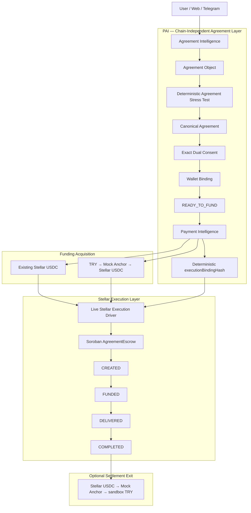

# PAI — Programmable Agreement Infrastructure

**AI interprets. Deterministic systems verify. Humans consent. Stellar executes.**

PAI turns natural-language agreements into structured, reviewable, programmable workflows and binds accepted agreement state to verifiable settlement execution.

For **Stellar Pro Hackathon — Scale**, PAI extends its existing agreement infrastructure with a **Stellar settlement execution layer**:

```text
Natural-language agreement
        ↓
Agreement Intelligence
        ↓
Deterministic Stress Test
        ↓
Canonical Agreement
        ↓
Exact Dual Consent
        ↓
Wallet Binding
        ↓
READY_TO_FUND
        ↓
Deterministic executionBindingHash
        ↓
Stellar Testnet
        ↓
Soroban AgreementEscrow
        ↓
CREATED → FUNDED → DELIVERED → COMPLETED
```

> **A ramp can show how TRY becomes USDC. PAI shows what that USDC can execute under an agreed, verifiable contract.**

## Hackathon status

- Canonical agreement lifecycle: **LIVE VERIFIED ✅**
- Deterministic execution binding: **LIVE VERIFIED ✅**
- Soroban AgreementEscrow: **DEPLOYED + LIVE VERIFIED ✅**
- 1 USDC agreement-bound settlement: **LIVE VERIFIED ✅**
- TRY → Stellar USDC sandbox/Testnet rail: **LIVE VERIFIED ✅**
- Stellar USDC → TRY sandbox/Testnet rail: **LIVE VERIFIED ✅**
- Public HTTPS demo: **LIVE ✅**
- Production banking/mainnet: **NOT CLAIMED**

## Links

- **Public GitHub:** https://github.com/Bezovskii/PAI-Stellar-Pro-Hackathon
- **Hackathon branch:** `stellar-pro-2026`
- **Current public demo:** https://portsmouth-stayed-promote-yearly.trycloudflare.com
- **Track:** SCALE
- **Network:** Stellar Testnet

> The Cloudflare URL is the current verified public demo path. If a stable Vercel production URL is finalized before submission, replace the demo URL above with that deployment URL.

---

# The problem

Smart contracts can execute an agreement perfectly and still execute a terrible agreement.

Alice hires Bob for a piece of work. But the deadline is vague, acceptance is undefined, and payment conditions are ambiguous.

Putting that agreement on-chain does not make it a good agreement.

**It makes the ambiguity executable.**

PAI is designed to solve the agreement problem **before money moves**.

---

# What PAI does

```text
Natural Language
      ↓
Agreement Intelligence
      ↓
Agreement Object
      ↓
Deterministic Stress Test
      ↓
Canonical Agreement Version
      ↓
Exact Human Acceptance
      ↓
Wallet Binding
      ↓
agreementHash
      ↓
READY_TO_FUND
```

The architecture separates two questions:

> **Agreement Intelligence determines WHEN money is legitimately allowed to move.**
> **The Settlement Router determines HOW that money should move.**

---

# Stellar Pro Hackathon — Scale

PAI was **not created from scratch during this hackathon**.

PAI entered Stellar Pro as an existing agreement infrastructure product. Stellar Pro extended that product with a Stellar financial execution layer and bidirectional sandbox/Testnet payment rails.

## Existing before Stellar Pro

| Capability | Status entering Stellar Pro |
| --- | --- |
| Natural-language Agreement Intelligence | Existing |
| Local Qwen + QLoRA work | Existing |
| Agreement Object | Existing |
| Deterministic Agreement Stress Test | Existing |
| Canonical agreement versions / hashes | Existing |
| Exact dual-party acceptance | Existing |
| Wallet binding | Existing |
| `READY_TO_FUND` lifecycle | Existing |
| Backend | Existing |
| Frontend | Existing |
| Telegram agreement flow | Existing |
| Arc settlement work | Existing |
| The Graph execution history | Existing |
| Uniswap routing experiment | Existing |

Dedicated Stellar Pro branch:

```text
stellar-pro-2026
```

Baseline commit used to create this isolated hackathon repository:

```text
a96d0ad49b635577f43394bf1c764d46544f5d12
```

## Built and verified during Stellar Pro

| Component | Purpose | Final status |
| --- | --- | --- |
| **StellarSettlementIntent** | Converts canonical PAI agreement state into deterministic settlement instructions | **IMPLEMENTED + TESTED ✅** |
| **Canonical settlement binding** | Binds agreement identity, parties, asset, network and amount into deterministic execution state | **LIVE VERIFIED ✅** |
| **Payment Intelligence** | Selects supported settlement paths including direct Stellar, TRY on-ramp and TRY off-ramp | **IMPLEMENTED + TESTED ✅** |
| **TRY Anchor integration layer** | Handles SEP discovery, SEP-10, SEP-12, SEP-38 and SEP-6 sandbox/Testnet flows | **LIVE VERIFIED ✅** |
| **Stellar funding service** | Coordinates exact canonical funding and truthful funding progress states | **IMPLEMENTED + TESTED ✅** |
| **Soroban AgreementEscrow** | Binds custody/release to canonical agreement and execution hashes | **DEPLOYED + LIVE VERIFIED ✅** |
| **Agreement-bound Stellar lifecycle** | `CREATED → FUNDED → DELIVERED → COMPLETED` | **LIVE VERIFIED ✅** |
| **TRY → Stellar USDC rail** | Sandbox TRY funding into Stellar Testnet USDC | **LIVE VERIFIED ✅** |
| **Stellar USDC → TRY rail** | Sandbox/Testnet recipient exit path | **LIVE VERIFIED ✅** |
| **Public HTTPS demo path** | Judge-facing frontend plus same-origin backend proxy | **LIVE VERIFIED ✅** |

### Hackathon implementation commits

```text
2872793  feat(stellar): add funding progress UX
b0b08f5  feat(stellar): add verified TRY anchor acquisition
4c422c4  feat: add deterministic payment intelligence routing
e29c66e  feat(stellar): add verified TRY offramp flow
fc70e5a  feat(stellar): add deployed Soroban agreement escrow
ee7f7dd  feat(stellar): add canonical funding and settlement execution
```

---

# Architecture

## PAI: Agreement Intelligence → Stellar Execution



PAI's intelligence remains chain-independent.

Stellar is the financial execution adapter.

### Architecture boundary

Funding acquisition and agreement execution are separate concerns.

The verified TRY on-ramp demonstrates that sandbox TRY can become independently verified Stellar Testnet USDC. The final agreement-bound Soroban trace used the payer's existing Stellar USDC balance and was executed through the tested live Stellar driver.

The architecture therefore **does not claim** that the final 1 USDC escrow trace was automatically funded by the verified TRY on-ramp.

Likewise, the off-ramp is an optional recipient-authorized settlement exit. It is **not** an automatic `COMPLETED → TRY` protocol transition.

---

# Final demo canonical agreement

**Capability origin:** PRE-EXISTING
**Final demo instance:** VERIFIED to `READY_TO_FUND` ✅

```text
agreementId:
cmu9gbwij0008dkuj8xjz0dlb

agreementVersion:
1

agreementHash:
0xcdaab16a6e4ba61e9a4f46273f88e9925c218934f224c5f112fc1791d6319096

settlementAsset:
USDC

amount:
1.0000000

amountBaseUnits:
10000000

final application status:
READY_TO_FUND
```

Verified application lifecycle:

```text
canonical agreement
→ exact client acceptance
→ exact contractor acceptance
→ wallet binding #1
→ wallet binding #2
→ READY_TO_FUND
```

This proof was produced through the real backend/application lifecycle.

No direct database mutation was used to manufacture the agreement state.

The final Stellar demo does not claim successful live local-model inference. The final canonical demo agreement was persisted through PAI's existing reviewed-agreement application path.

---

# Deterministic execution binding

The canonical agreement was converted into a locked Stellar execution tuple.

```text
executionBindingHash:
59b398f0a37751a596179a48fac54d9ef73ed033bcdfe022619433e9e5a0adfe

network:
stellar-testnet

payer:
GC4CKF3TLUAXUG5CR7WIQTRXEQYQOV76TT4FTZHIEY7SET7A75OF3KRV

recipient:
GBJKQCGXP5PYCXA25HQNYJB63BJ7HMDAFNM6AFZARGBP7P7JBSLO2L6S

asset:
USDC

issuer:
GBBD47IF6LWK7P7MDEVSCWR7DPUWV3NY3DTQEVFL4NAT4AQH3ZLLFLA5

USDC SAC:
CBIELTK6YBZJU5UP2WWQEUCYKLPU6AUNZ2BQ4WWFEIE3USCIHMXQDAMA

amount:
10000000 base units
```

Both `agreementHash` and `executionBindingHash` were independently read back from the deployed Soroban contract and matched the locked PAI values exactly.

This binding is the core of the Stellar integration:

```text
PAI canonical agreement
        +
exact settlement execution tuple
        ↓
executionBindingHash
        ↓
Soroban AgreementEscrow
```

---

# Soroban AgreementEscrow

**Status: IMPLEMENTED + TESTED + DEPLOYED + LIVE VERIFIED ✅**

```text
network:
Stellar Testnet

contract:
CAXZYU742IQ7SL7U645RT4PCKMD47DAJXLMMOZ6USKGY62QF22ADRYEG

Wasm SHA256:
65fd7b2345c7935e89b1808171ad8927b9560cb9d5fc37846d0f4206b4e13b31

Wasm upload tx:
fd45c7941df35ea34bb6db281135f55e2dd0d9281ed7071b41c3b0437e8623c3

deploy tx:
a60541245e3d3ec62d918adf01207996781069fa6ba1d789da5b725900f40029

deploy ledger:
4758368
```

Public repository Soroban source:

```text
soroban/
└── contracts/
    └── agreement-escrow/
        ├── Cargo.toml
        └── src/
            ├── lib.rs
            └── test.rs
```

Reproducible public-worktree test result:

```text
cargo test

1 passed
0 failed
```

> Earlier development lanes contained broader test suites. The public hackathon repository reports the test count that judges can reproduce from this repository directly.

---

# Verified agreement-bound Stellar lifecycle

**LIVE STELLAR TESTNET VERIFIED ✅**

Final verified path:

```text
canonical agreement
→ exact dual-party acceptance
→ wallet binding
→ READY_TO_FUND
→ deterministic executionBindingHash
→ live Stellar execution driver
→ initialize
→ CREATED
→ fund 1.0000000 USDC
→ FUNDED
→ deliver
→ DELIVERED
→ release
→ COMPLETED
→ escrow final balance = 0
→ recipient +1.0000000 USDC
```

Proof identifiers:

```text
agreementHash:
0xcdaab16a6e4ba61e9a4f46273f88e9925c218934f224c5f112fc1791d6319096

executionBindingHash:
59b398f0a37751a596179a48fac54d9ef73ed033bcdfe022619433e9e5a0adfe

deliveryEvidenceHash:
6b7feac799fbbdffbd5b55e626e5187aab9a6b8d43045fd5013e350912a54d98
```

## Initialize

```text
tx:
15566efbefe5b9005fa2aec994bbab2d1a7cbbb52a03b01909bf9d3f45d20326

ledger:
4773030

state:
CREATED
```

## Fund

```text
tx:
475fa3afb60cef9e6b98bd2a8e11e1ee2a132bbed074efb6f38d681b693ae9db

ledger:
4773031

state:
FUNDED

escrow:
1.0000000 USDC
```

## Deliver

```text
tx:
de1f4fdb650918426ba32d2ec4a761dbf7ff215a471aab9bb78614a5fab2df6e

ledger:
4773032

state:
DELIVERED

escrow:
1.0000000 USDC
```

## Release

```text
tx:
6600da8a31864dd82396a2963bf7d56be735182254f84bd8bebcab13a5a83c84

ledger:
4773034

state:
COMPLETED
```

## Final reconciliation

```text
escrow final balance:
0

recipient before release:
2.0000000 USDC

recipient after release:
3.0000000 USDC

recipient delta:
+1.0000000 USDC

payer after:
17.0198045 USDC

FINAL_E2E:
PASS ✅
```

### Safe submission claim

> PAI verified a complete agreement-bound Stellar Testnet lifecycle from a real canonical agreement at `READY_TO_FUND`, through deterministic execution binding, Soroban initialization, 1 USDC funding, delivery, release, and `COMPLETED`, with zero escrow remaining and exactly 1 USDC delivered to the recipient.

### Execution boundary

The final live mutation is **not** described as:

```text
browser
→ backend funding endpoint
→ Router HTTP
→ Soroban
```

The verified final execution trace is:

```text
PAI canonical agreement
→ deterministic execution binding
→ live Stellar execution driver
→ deployed Soroban AgreementEscrow
→ initialize
→ fund
→ deliver
→ release
→ COMPLETED
```

The browser/backend public path is independently verified as a judge-facing product surface, but it is not claimed as the trigger for the final on-chain trace.

---

# TRY → Stellar USDC on-ramp

**LIVE SANDBOX / TESTNET VERIFIED ✅**

```text
50.00 TRY
→ Mock Anchor sandbox
→ 1.0198045 USDC
→ Stellar Testnet
```

Proof:

```text
Stellar tx:
98bb1d96b0c05506bfb525d494507180e89ed57fd7b0d92e64602533dd0e3196

ledger:
4758559

quote:
qt_bb0b2fqwzo61hpr5vb13

Anchor transaction:
sep_0i5bpcz129ozjsjr3pb4

proof:
pai.asset-acquisition-proof.v1

independent Horizon verification:
PASS ✅
```

Safe claim:

> PAI live-verified a sandbox/Testnet TRY → Stellar USDC acquisition path.

No production Turkish banking or production bank rail is claimed.

---

# Stellar USDC → TRY off-ramp

**LIVE SANDBOX / TESTNET VERIFIED ✅**

```text
source account:
GBJKQCGXP5PYCXA25HQNYJB63BJ7HMDAFNM6AFZARGBP7P7JBSLO2L6S

pre balance:
3.0000000 USDC

sell:
2.0000000 USDC

SEP-12:
ACCEPTED

customer ID:
cus_r4e9ftazfi9miscwnoot

SEP-38 quote:
qt_rbto9c0xs0iott4que08

SEP-6 withdrawal:
sep_pj826fkl2ptcpsgpchbg

destination account:
GCLCZEQZ2THTEDAOFI66LACNPLY4OBKN7VKLEZFMBIHYKYQOW2W7T3Z6

memo type:
id

memo:
943166877686

Stellar tx:
1de39ba9bf3282de8acca9ac3ff258392578875de9f3667bf1ef8a4f8804c4ce

ledger:
4773339

Horizon verification:
PASS ✅

sandbox TRY payout:
97.08 TRY

payout reference:
FAST-COWNHAD91I

post balance:
1.0000000 USDC

proof:
pai.try-offramp-proof.v1

proof status:
verified

LIVE_OFFRAMP_VERIFIED:
YES ✅
```

Verified state path:

```text
QUOTING
→ ANCHOR_PENDING
→ STELLAR_SENDING
→ PAYMENT_SUBMITTED
→ STELLAR_VERIFIED
→ TRY_PAID
```

Safe claim:

> PAI live-verified a Stellar Testnet USDC → sandbox TRY off-ramp. The live reverse rail converted 2.0000000 USDC into a verified 97.08 TRY sandbox payout.

No production Turkish banking, real bank payout, or mainnet execution is claimed.

The off-ramp used the same recipient Stellar account after settlement.

Because USDC is fungible, the repository does **not** claim cryptographic attribution that the exact 1 USDC released by Soroban was the specific unit later off-ramped.

---

# Payment rail summary

```text
TRY
→ Stellar Testnet USDC
LIVE VERIFIED ✅

READY_TO_FUND
→ deterministic execution binding
→ Soroban
→ CREATED
→ FUNDED
→ DELIVERED
→ COMPLETED
LIVE VERIFIED ✅

Stellar Testnet USDC
→ sandbox TRY
LIVE VERIFIED ✅
```

Safe overall statement:

> PAI has live-verified sandbox/Testnet payment rails in both directions: TRY → Stellar USDC and Stellar USDC → TRY.

---

# Payment Intelligence

**IMPLEMENTED + TESTED ✅**

Payment Intelligence determines **HOW** an obligation can be fulfilled after the agreement has reached a legitimate fundable state.

Supported selector outcomes include:

```text
DIRECT_STELLAR
TRY_ONRAMP
TRY_OFFRAMP
NO_ROUTE
```

The selector is deterministic and fail-closed.

The final agreement-bound live trace does **not** claim that Payment Intelligence automatically selected the specific route used for that final on-chain execution unless separate proof supports that statement.

---

# Stellar settlement intent and funding service

## StellarSettlementIntent

The settlement-intent layer converts a canonical PAI agreement into a deterministic Stellar execution instruction.

Relevant public source:

```text
backend/src/stellar-settlement/
├── acquisition.ts
├── canonical-intent.ts
├── executor.ts
├── intent.ts
└── sdk-transport.ts
```

The binding covers the exact settlement tuple, including:

- canonical agreement identity
- agreement version/hash
- Stellar Testnet
- payer
- recipient
- USDC issuer
- SAC token contract
- canonical amount

## Stellar funding service

Relevant public source:

```text
backend/src/stellar-funding/service.ts
```

The funding service coordinates truthful funding progress and exact target acquisition behavior.

Verified state handling includes:

```text
QUOTING
ANCHOR_PENDING
STELLAR_SENDING
STELLAR_VERIFIED
FUNDED
FAILED
```

The service refuses to mark funding complete unless the resulting transaction and contract state match the canonical settlement intent.

---

# Test evidence

## Stellar integration gate

Latest focused public-worktree integration gate:

```text
28 tests
28 passed
0 failed
```

Covered areas include:

- canonical TRY funding state progression
- retryable failed funding
- canonical lifecycle mismatch rejection
- verified TRY acquisition binding
- recipient mismatch rejection
- USDC issuer mismatch rejection
- amount mismatch rejection
- insufficient balance rejection
- canonical Stellar settlement intent creation
- exact decimal/base-unit conversion
- pre-`READY_TO_FUND` rejection
- incomplete wallet binding rejection
- agreementHash mismatch rejection
- non-USDC settlement rejection
- over-precision / zero-value rejection
- on-chain `FUNDED` verification
- agreementHash verification
- executionBindingHash verification
- token/amount verification
- deterministic execution-binding coverage
- target-side SEP-38 quote behavior
- max TRY ceiling enforcement
- legacy sell-side quote behavior

Command:

```powershell
cd backend

node --import tsx --test `
  test/stellar-funding.service.test.ts `
  test/stellar-settlement.acquisition.test.ts `
  test/stellar-settlement.canonical-intent.test.ts `
  test/stellar-settlement.executor.test.ts `
  test/stellar-settlement.intent.test.ts `
  test/try-anchor.target-quote.test.ts
```

## Backend typecheck

```text
PASS ✅
```

Command:

```powershell
npm.cmd --prefix backend run typecheck
```

## Soroban

```text
1 passed
0 failed
```

Command:

```powershell
cd soroban
cargo test
```

---

# Public demo

**LIVE ✅**

Current URL:

```text
https://joel-olympics-julian-circumstances.trycloudflare.com
```

Verified path:

```text
public browser
→ Cloudflare Quick Tunnel
→ Vite :5173
→ same-origin /api proxy
→ real local backend :3001
```

Verification:

```text
public root:
HTTP 200 ✅

public /api auth session:
HTTP 401 unauthenticated as expected ✅

browser render:
PASS ✅

CORS:
PASS ✅

localhost exposed to browser:
NO ✅

funding panel:
PASS ✅
```

Judge-facing backend access is reached through the same-origin `/api` proxy.

The final Stellar lifecycle mutation was executed through the tested live Stellar driver directly, not through the public browser funding button.

---

# Product distinction

An anchor solves:

```text
Fiat
→ digital asset
```

PAI extends that into:

```text
human agreement
→ structured agreement
→ deterministic validation
→ exact consent
→ fundable canonical state
→ programmable settlement
```

With Stellar, that becomes:

```text
canonical agreement
→ settlement intent
→ Stellar asset
→ agreement-bound Soroban execution
→ verified release
→ optional recipient off-ramp
```

> **An anchor converts between fiat and digital assets. PAI determines what those assets are allowed to execute under an agreed, verifiable contract.**

---

# Why Stellar fits PAI

## PAI Core determines

- what the parties agreed to
- whether the agreement is sufficiently objective
- which canonical version they accepted
- whether both parties accepted the same exact version
- whether both wallets are bound
- whether the agreement reached `READY_TO_FUND`
- when release conditions are satisfied

## Stellar execution layer provides

- fiat-entry integration through an anchor/provider abstraction
- Stellar asset verification
- deterministic settlement binding
- Soroban agreement-bound escrow
- programmable release
- optional recipient exit into sandbox TRY

> **PAI already knows what the parties agreed to and when that agreement becomes fundable. Stellar gives that agreement a programmable settlement path.**

---

# Repository structure

Important areas:

```text
ai/                         Agreement Intelligence / model work
apps/                       Application surfaces including Telegram
backend/                    PAI backend and lifecycle services
backend/src/stellar-funding Stellar funding orchestration
backend/src/stellar-settlement
                            Stellar settlement intent / execution
backend/src/try-anchor      TRY anchor SEP integration
contracts/                  Existing smart-contract foundation
frontend/                   Web interface
mobile/                     Mobile work
packages/                   Shared packages / contracts
soroban/                    Stellar Pro Soroban workspace
subgraph/                   Existing execution-history indexing work
test/                       Existing tests
test-foundry/               Existing Foundry tests
```

Soroban contract:

```text
soroban/contracts/agreement-escrow/
```

---

# Existing PAI lifecycle

```text
DEFINE
→ ACCEPT
→ FUND
→ DELIVER
→ SETTLE
```

Exception path:

```text
DISPUTE
→ EVIDENCE
→ ARBITRATION
→ RESOLUTION
```

The Stellar work extends the **execution** side of that lifecycle. It does not replace the agreement model.

---

# Agreement Intelligence

AI may help with:

- agreement structuring
- ambiguity detection
- missing terms
- risk identification
- clarification suggestions

AI does **not** receive unilateral authority to:

- custody funds
- sign user transactions
- alter an accepted canonical agreement
- release escrow
- make final arbitration decisions

> **AI interprets. Deterministic systems verify.**

## Final hackathon inference boundary

```text
Agreement Intelligence:
IMPLEMENTED ✅

Deterministic Agreement Stress Test:
IMPLEMENTED ✅
TESTED ✅

Canonical reviewed-agreement flow:
VERIFIED ✅

Local Qwen final inference:
NOT VERIFIED ❌
```

The final canonical demo agreement used the existing reviewed-agreement path.

The repository does not claim that the local Qwen runtime successfully generated the final demo agreement.

---

# Deterministic Stress Test

PAI asks more than whether an agreement is syntactically valid.

It asks:

> **How could either party abuse this agreement?**

The stress-test layer is designed to identify problems such as:

- undefined acceptance criteria
- contradictory deadlines
- indefinite approval periods
- missing dispute paths
- ambiguous partial delivery
- inconsistent payment conditions
- impossible or exploitable state transitions

This happens before execution.

---

# Security model

PAI separates authority across layers.

## Agreement / protocol layer

Responsible for:

- canonical agreement identity
- exact accepted version/hash
- participant identities/wallet bindings
- lifecycle state
- release conditions
- dispute state

## Backend

Responsible for:

- authenticated application sessions
- metadata
- evidence references
- application history
- orchestration
- intelligence access

## AI

Responsible for interpretation and recommendations only.

## Stellar execution adapter

Responsible for:

- deterministic settlement-intent construction
- anchor/provider abstraction
- independent Stellar transaction verification
- Soroban escrow interaction
- release execution
- fail-closed mismatch handling

Private keys should remain user-controlled.

---

# Technology foundation

## Existing PAI

- Node.js
- TypeScript
- Fastify
- Prisma
- PostgreSQL
- React
- Vite
- Telegram
- SIWE
- Solidity
- Hardhat
- Foundry
- Ethers.js
- Arc settlement work
- The Graph
- Uniswap routing experiments

## Stellar Pro additions

- Stellar SDK
- Stellar CLI
- Stellar Testnet
- Soroban
- Soroban AgreementEscrow
- Stellar Settlement Intent
- deterministic execution binding
- Stellar funding service
- Payment Intelligence
- SEP-10
- SEP-12
- SEP-38
- SEP-6
- sandbox TRY anchor/provider integration
- Horizon verification

---

# Local development

## PostgreSQL

```powershell
cd backend
docker compose up -d postgres
docker compose ps
```

## Backend

```powershell
cd backend
npx.cmd prisma migrate deploy
npm.cmd run dev
```

## Frontend

```powershell
cd frontend
npm.cmd run dev
```

## Backend typecheck

From the repository root:

```powershell
npm.cmd --prefix backend run typecheck
```

## Stellar integration tests

```powershell
cd backend

node --import tsx --test `
  test/stellar-funding.service.test.ts `
  test/stellar-settlement.acquisition.test.ts `
  test/stellar-settlement.canonical-intent.test.ts `
  test/stellar-settlement.executor.test.ts `
  test/stellar-settlement.intent.test.ts `
  test/try-anchor.target-quote.test.ts
```

## Soroban tests

```powershell
cd soroban
cargo test
```

---

# Limitations

PAI's Stellar Pro proof is deliberately scoped.

The final submission **does not claim**:

- Stellar mainnet deployment
- production Turkish banking integration
- a real production TRY bank payout
- that the final TRY on-ramp automatically funded the exact final 1 USDC Soroban trace
- that the exact released 1 USDC was cryptographically identified as the 2 USDC later off-ramped
- that the public browser funding button triggered the final live Soroban lifecycle
- successful final live Qwen generation of the canonical demo agreement

The verified payment rails are sandbox/Testnet integrations.

The verified Soroban lifecycle is Stellar Testnet execution.

These boundaries are intentional and preserve a strict distinction between:

```text
IMPLEMENTED
TESTED
DEPLOYED
LIVE VERIFIED
```

---

# Final component status

| Component | Implemented | Tested | Deployment | Live verification |
| --- | ---: | ---: | --- | --- |
| Agreement Intelligence | ✅ | ✅ | — | Reviewed canonical path verified |
| Deterministic Stress Test | ✅ | ✅ | — | ✅ |
| Canonical agreement lifecycle | ✅ | ✅ | Local backend | ✅ |
| Payment Intelligence | ✅ | ✅ | — | Route selection not claimed in final E2E |
| TRY → USDC Anchor path | ✅ | ✅ | Sandbox/Testnet | ✅ |
| Soroban AgreementEscrow | ✅ | ✅ 1/1 public repo | Stellar Testnet | ✅ |
| Execution binding | ✅ | ✅ | Stellar Testnet contract state | ✅ |
| Stellar settlement/funding integration | ✅ | ✅ 28/28 focused tests | — | ✅ |
| Live Stellar lifecycle | ✅ | ✅ | Stellar Testnet | ✅ |
| USDC → TRY off-ramp | ✅ | ✅ | Sandbox/Testnet | ✅ |
| Public frontend/backend | ✅ | Build PASS | HTTPS tunnel | ✅ |
| Local Qwen final inference | ✅ | Runtime tested | Local | ❌ final live generation |

---

# Scale-track positioning

> **PAI entered Stellar Pro with agreement understanding, validation and consent already built. Stellar Pro added financial execution.**

> **PAI was not rebuilt on Stellar. An existing agreement system was extended with a Stellar financial execution layer.**

The Scale-specific result is not just a new smart contract.

The hackathon proof connects:

```text
existing product
→ real canonical agreement state
→ deterministic Stellar execution binding
→ deployed Soroban execution
→ live Testnet settlement
→ bidirectional sandbox TRY rails
```

That is the bridge from agreement infrastructure to a locally relevant settlement product.

---

# Post-hackathon roadmap

The next stage is to convert the hackathon proof into production-grade infrastructure suitable for further ecosystem evaluation, including SCF / InstAward pathways.

Priority work:

1. replace sandbox TRY behavior with a production-capable regulated provider/anchor
2. move from Testnet proof to production-readiness review and Mainnet deployment planning
3. expose the verified settlement router through the public product flow
4. add production-grade wallet signing and custody boundaries
5. expand agreement-bound settlement beyond a single asset/provider
6. add stronger operational monitoring, reconciliation and recovery
7. onboard real pilot users and collect usage evidence
8. package architecture, security assumptions and deployment evidence for follow-on funding review

---

# AI usage

PAI uses AI both as a development assistant and as part of the product architecture.

The existing project includes local Qwen / QLoRA work for natural-language agreement interpretation and structured agreement extraction.

PAI does not treat AI output as authoritative.

Deterministic validation, human review, canonical version/hash acceptance, wallet binding and protocol execution remain separate responsibilities.

See [AI_USAGE.md](./AI_USAGE.md) for additional disclosure.

---

# Final submission summary

PAI now has a verified end-to-end agreement execution proof on Stellar Testnet:

```text
real canonical PAI agreement
→ exact dual consent
→ wallet binding
→ READY_TO_FUND
→ deterministic execution binding
→ deployed Soroban AgreementEscrow
→ CREATED
→ 1 USDC FUNDED
→ DELIVERED
→ COMPLETED
→ escrow = 0
→ recipient +1 USDC
```

PAI also has separately verified sandbox/Testnet payment rails in both directions:

```text
TRY → Stellar USDC ✅
Stellar USDC → TRY ✅
```

The public judge-facing frontend/backend path is live over HTTPS.

The remaining work is release packaging, stable deployment and submission—not additional core technical proof.

---

# License

MIT License.

Copyright (c) 2026 Behzad Khoshian
