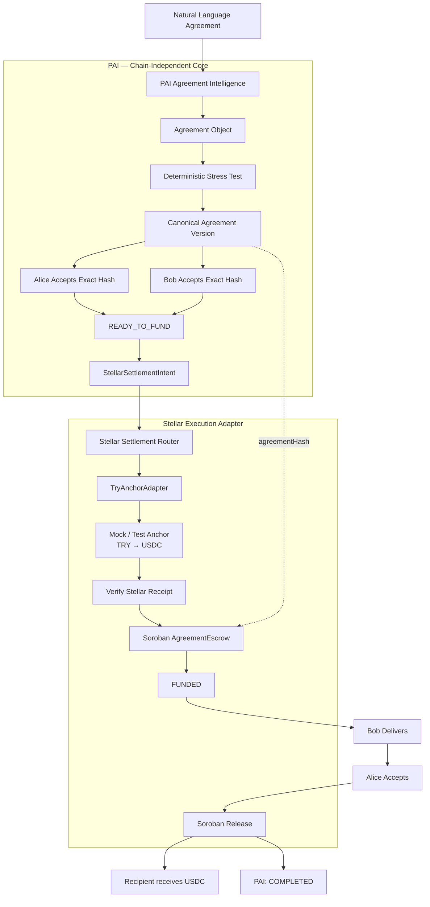

# PAI — Programmable Agreement Infrastructure

**AI interprets. Deterministic systems verify. Humans consent. Protocols execute.**

PAI turns natural-language agreements into structured, reviewable, programmable workflows.

For **Stellar Pro Hackathon — Scale**, I am extending the existing PAI product with a **Stellar settlement execution layer**:

```text
Agreement understanding + consent
                ↓
          READY_TO_FUND
                ↓
      Stellar execution path
                ↓
 TRY → USDC → Soroban escrow → release
```

> **A ramp can show how TRY becomes USDC. PAI shows what that USDC can execute under an agreed, verifiable contract.**

---

## The problem

Smart contracts can execute an agreement perfectly and still execute a terrible agreement.

Alice hires Bob for a piece of work. But the deadline is vague, acceptance is undefined, and payment conditions are ambiguous.

Putting that agreement on-chain does not make it a good agreement.

**It makes the ambiguity executable.**

PAI is designed to solve the agreement problem **before money moves**.

---

## What PAI does

```text
Natural Language
      ↓
Agreement Intelligence
      ↓
Agreement Object
      ↓
Deterministic Stress Test
      ↓
Canonical Agreement Version
      ↓
Exact Human Acceptance
      ↓
agreementHash
      ↓
READY_TO_FUND
```

The architecture separates two questions:

> **Agreement Intelligence determines WHEN money is legitimately allowed to move.**  
> **The Settlement Router determines HOW that money should move.**

---

# Stellar Pro Hackathon — Scale

PAI is **not being created from scratch during this hackathon**.

PAI entered Stellar Pro as an existing agreement infrastructure product. The goal of this hackathon is to extend that existing product with a Stellar financial execution layer.

## Existing before Stellar Pro

| Capability | Status entering Stellar Pro |
| --- | --- |
| Natural-language Agreement Intelligence | Existing |
| Local Qwen + QLoRA work | Existing |
| Agreement Object | Existing |
| Deterministic Agreement Stress Test | Existing |
| Canonical agreement versions / hashes | Existing |
| Exact dual-party acceptance | Existing |
| Wallet binding | Existing |
| `READY_TO_FUND` lifecycle | Existing |
| Backend | Existing |
| Frontend | Existing |
| Telegram agreement flow | Existing |
| Arc settlement work | Existing |
| The Graph execution history | Existing |
| Uniswap routing experiment | Existing |

Dedicated Stellar Pro branch:

```text
stellar-pro-2026
```

Baseline commit used to create this isolated hackathon repository:

```text
a96d0ad49b635577f43394bf1c764d46544f5d12
```

---

# What we are building during Stellar Pro

The Stellar-specific components below are **hackathon targets**.

They are intentionally **not presented as completed** until source code, tests, deployment evidence and transaction proof exist.

| Component | Purpose | Status |
| --- | --- | --- |
| **StellarSettlementIntent** | Converts PAI agreement state into a deterministic settlement instruction | Building |
| **TryAnchorAdapter** | Isolates TRY / anchor-specific funding logic from PAI Core | Building |
| **Stellar Settlement Router** | Chooses and coordinates the Stellar execution path | Building |
| **Soroban AgreementEscrow** | Binds programmable custody and release to the canonical PAI agreement | Building |
| **TRY → USDC → escrow → release orchestration** | Proves the components operate as one settlement path | Building |

---

# Architecture

## PAI: Agreement Intelligence → Stellar Execution



PAI's intelligence remains chain-independent.

Stellar is the financial execution adapter.

> **We are not moving PAI's intelligence onto Stellar. We are connecting PAI's agreement state to Stellar execution.**

---

# Target end-to-end flow

```text
Natural-language agreement
→ Agreement Object
→ deterministic Stress Test
→ canonical agreement version
→ Alice accepts exact hash
→ Bob accepts exact hash
→ READY_TO_FUND
→ StellarSettlementIntent
→ Stellar Settlement Router
→ TryAnchorAdapter
→ TRY funding
→ USDC on Stellar
→ Soroban AgreementEscrow
→ delivery
→ acceptance
→ release
→ COMPLETED
```

---

# The critical binding

The target proof is:

```text
PAI agreementHash
=
Soroban AgreementEscrow agreementHash
```

This is the core of the Stellar integration.

The money should not sit in a generic escrow disconnected from the agreement that created it.

The Soroban escrow should be cryptographically bound to the exact canonical agreement version accepted by both parties.

When implemented and deployed, this section will contain:

- PAI agreement hash
- Soroban contract ID
- deployment transaction
- funding transaction
- release transaction
- final lifecycle state

---

# Why Stellar fits PAI

## PAI Core determines

- what the parties agreed to
- whether the agreement is sufficiently objective
- which canonical version they accepted
- whether both parties accepted the same exact version
- whether the agreement reached `READY_TO_FUND`
- when release conditions are satisfied

## Stellar execution layer provides

- fiat-entry integration through an anchor/provider abstraction
- Stellar asset verification
- settlement routing
- Soroban agreement-bound escrow
- programmable release

> **PAI already knows what the parties agreed to and when that agreement becomes fundable. The Stellar integration gives that agreement a programmable settlement path.**

---

# The product distinction

An anchor solves:

```text
Fiat
→ digital asset
```

PAI extends that into:

```text
Fiat
→ digital asset
→ canonical agreement
→ programmable escrow
→ verified release condition
→ settlement
```

> **An anchor normally turns lira into a digital asset. PAI turns that digital asset into an enforceable agreement.**

---

# Demo target

Once the Stellar components are proven, the demo should show one uninterrupted lifecycle:

```text
READY_TO_FUND
→ TRY funding
→ USDC obtained
→ Stellar receipt verified
→ Soroban escrow funded
→ delivery
→ acceptance
→ release
→ COMPLETED
```

The key visual proof should be:

```text
PAI Agreement
agreementHash:
0x...

Soroban AgreementEscrow
agreementHash:
0x...
```

with both values identical.

Then:

```text
PAI lifecycle: COMPLETED
Soroban escrow: RELEASED
```

---

# Evidence ledger

This section will be updated as implementation proof lands.

## StellarSettlementIntent

**Status:** Not yet claimed complete

Proof to add:

- source path
- schema/interface
- example serialized intent
- passing validation tests
- agreement ID/version/hash

## TryAnchorAdapter

**Status:** Not yet claimed complete

Proof to add:

- provider or mock-anchor identity
- TRY input
- USDC output
- quote/reference ID
- expiry
- response proof
- explicit mock/testnet labeling

## Stellar Settlement Router

**Status:** Not yet claimed complete

Proof to add:

- input intent
- selected adapter
- route result
- invalid/blocked execution behavior

## Soroban AgreementEscrow

**Status:** Not yet claimed complete

Proof to add:

- Soroban contract ID
- Stellar network
- deployment transaction
- deployment ledger
- contract source
- test output
- initial state

## Funding

**Status:** Not yet claimed complete

Proof to add:

- payer Stellar address
- asset
- amount
- transaction hash
- ledger/explorer evidence
- resulting escrow state

## Agreement binding

**Status:** Not yet claimed complete

Required proof:

```text
PAI agreementHash == Soroban agreementHash
```

## Delivery and release

**Status:** Not yet claimed complete

Proof to add:

- delivery/evidence reference
- acceptance event
- release transaction
- final Soroban state
- recipient result
- PAI `COMPLETED`

---

# Repository structure

Major existing areas:

```text
ai/           Agreement Intelligence / model work
apps/         Application surfaces including Telegram
backend/      PAI backend and lifecycle services
contracts/    Existing smart-contract foundation
frontend/     Web interface
mobile/       Mobile work
packages/     Shared packages / contracts
subgraph/     Existing execution-history indexing work
test/         Existing tests
test-foundry/ Existing Foundry tests
```

Stellar-specific source locations will be documented here as they are added.

---

# Existing PAI lifecycle

```text
DEFINE
→ ACCEPT
→ FUND
→ DELIVER
→ SETTLE
```

Exception path:

```text
DISPUTE
→ EVIDENCE
→ ARBITRATION
→ RESOLUTION
```

The Stellar work extends the **execution** side of that lifecycle. It does not replace the agreement model.

---

# Agreement Intelligence

AI may help with:

- agreement structuring
- ambiguity detection
- missing terms
- risk identification
- clarification suggestions

AI does **not** receive unilateral authority to:

- custody funds
- sign user transactions
- alter an accepted canonical agreement
- release escrow
- make final arbitration decisions

> **AI interprets. Deterministic systems verify.**

---

# Deterministic Stress Test

PAI asks more than whether an agreement is syntactically valid.

It asks:

> **How could either party abuse this agreement?**

The stress-test layer is designed to identify problems such as:

- undefined acceptance criteria
- contradictory deadlines
- indefinite approval periods
- missing dispute paths
- ambiguous partial delivery
- inconsistent payment conditions
- impossible or exploitable state transitions

This happens before execution.

---

# Security model

PAI separates authority across layers.

## Agreement / protocol layer

Responsible for:

- canonical agreement identity
- exact accepted version/hash
- participant identities/wallet bindings
- lifecycle state
- release conditions
- dispute state

## Backend

Responsible for:

- authenticated application sessions
- metadata
- evidence references
- application history
- orchestration
- intelligence access

## AI

Responsible for interpretation and recommendations only.

## Stellar execution adapter

Target responsibility:

- settlement-intent execution
- anchor/provider abstraction
- Stellar transaction verification
- Soroban escrow interaction
- release execution

Private keys should remain user-controlled.

---

# Technology foundation

### Existing PAI

- Node.js
- TypeScript
- Fastify
- Prisma
- PostgreSQL
- React
- Vite
- Telegram
- SIWE
- Solidity
- Hardhat
- Foundry
- Ethers.js
- Arc settlement work
- The Graph
- Uniswap routing experiments

### Stellar Pro target additions

- Stellar tooling
- Soroban
- Stellar Testnet
- Stellar Settlement Intent
- Stellar Settlement Router
- TRY anchor/provider abstraction

The exact target stack will be updated as implementation evidence lands.

---

# Local development

For the existing PAI stack:

### PostgreSQL

```powershell
cd backend
docker compose up -d postgres
docker compose ps
```

### Existing local EVM development

```powershell
npx.cmd hardhat node
```

### Backend

```powershell
cd backend
npx.cmd prisma migrate deploy
npm.cmd run dev
```

### Frontend

```powershell
cd frontend
npm.cmd run dev
```

Dedicated Stellar development instructions will be added once the new Stellar components exist and are verified.

---

# Limitations

At the start of Stellar Pro:

- the five-component Stellar execution path is not claimed complete
- no real TRY production rail is claimed
- no production anchor integration is claimed
- no Soroban deployment is claimed until deployment and transaction proof are recorded
- mock/testnet infrastructure will be labeled as mock/testnet
- pre-existing PAI features are not claimed as hackathon-built work

This separation is deliberate.

---

# What success looks like

A successful Stellar Pro implementation proves:

1. PAI structures and validates the agreement.
2. Both parties consent to the exact canonical agreement.
3. PAI reaches `READY_TO_FUND`.
4. A deterministic Stellar settlement intent is created.
5. TRY funding is routed through the anchor/provider abstraction.
6. Stellar funding is independently verified.
7. Soroban escrow is funded.
8. Soroban contains the **same canonical agreement hash** accepted in PAI.
9. Delivery and acceptance satisfy the release condition.
10. Soroban releases the asset.
11. PAI reaches `COMPLETED`.

---

# Scale-track positioning

> **PAI already solved agreement understanding, validation and consent. Stellar Pro adds financial execution.**

> **We didn't rebuild PAI on Stellar. We extended an existing agreement system with a Stellar financial execution layer.**

---

# AI usage

PAI uses AI both as a development assistant and as part of the product architecture.

The existing project includes local Qwen / QLoRA work for natural-language agreement interpretation and structured agreement extraction.

PAI does not treat AI output as authoritative.

Deterministic validation, human review, canonical version/hash acceptance, wallet binding and protocol execution remain separate responsibilities.

See [AI_USAGE.md](./AI_USAGE.md) for additional disclosure.

---

# License

MIT License.

Copyright (c) 2026 Behzad Khoshian
